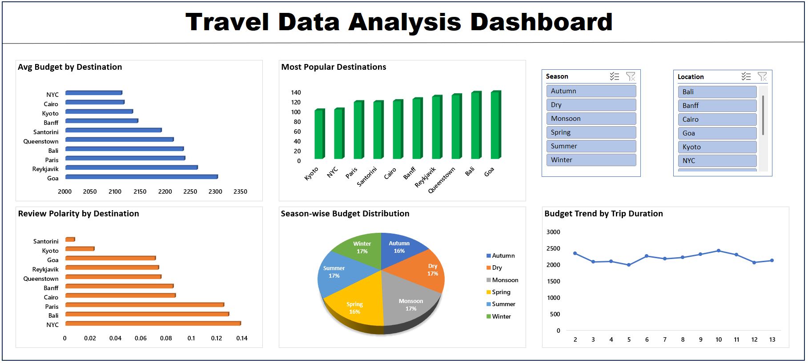

# ✈️ Travel Data Analysis Dashboard

## 📊 Project Overview

🚀 Built an interactive Excel dashboard project focuses on analyzing travel data to uncover insights related to pricing trends, destination popularity, customer sentiment, and seasonal patterns. The dashboard is built using Microsoft Excel with interactive features for better decision-making.

---

## 🎯 Objectives

* Analyze travel package pricing across destinations
* Identify most popular travel locations
* Evaluate customer sentiment using review polarity
* Understand seasonal impact on travel costs
* Explore relationship between trip duration and budget

---

## 🛠️ Tools & Technologies

* Microsoft Excel
* Pivot Tables
* Charts & Data Visualization
* Slicers (Interactive Filters)

---

## 📈 Key Features

* Interactive dashboard using slicers
* Multiple pivot tables for structured analysis
* Visual insights using bar, column, pie, and line charts
* Clean and organized dataset

---

## 📊 Key Insights

* High-demand destinations have higher average pricing
* Popular destinations show higher travel frequency
* Seasonal variations significantly impact travel costs
* Longer trips tend to increase overall budget
* Customer sentiment varies across destinations

---

## 📸 Dashboard Preview

Below is the interactive dashboard built using Excel:

---

## 🚀 How to Use

1. Download the Excel file
2. Open in Microsoft Excel
3. Navigate to the **Dashboard** sheet
4. Use slicers (filters) to interact with data

---

## 💡 Future Improvements

* Add Power BI version of dashboard
* Include advanced analytics using Python

---

## 🙌 Conclusion

This project demonstrates the use of Excel for data analysis and dashboard creation. It highlights how raw data can be transformed into meaningful insights using visualization and interactive tools.

---

## 👨‍💻 Author

Himanshu

